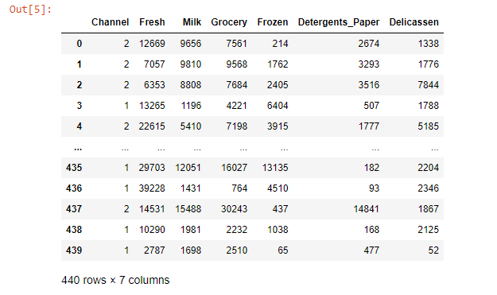
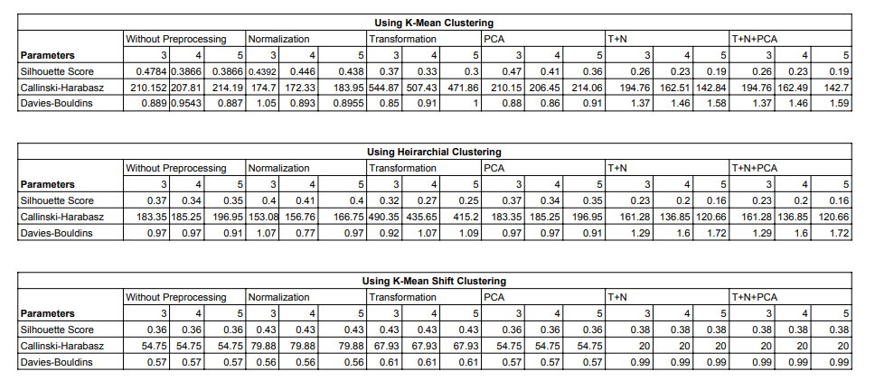
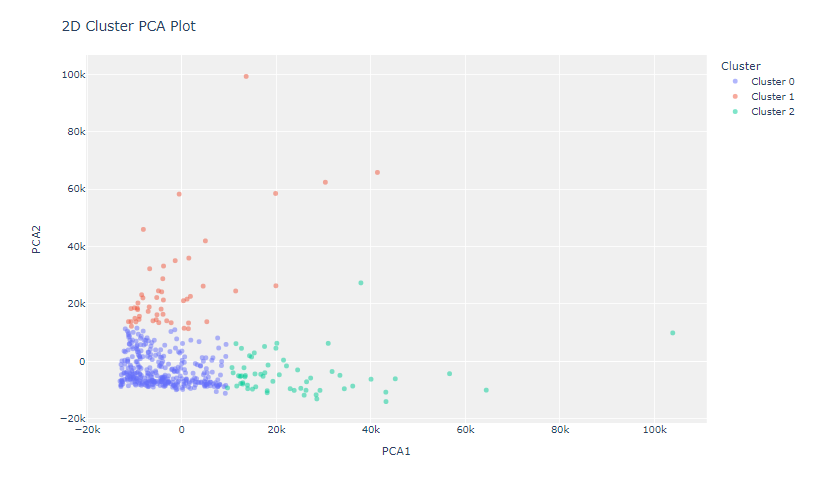
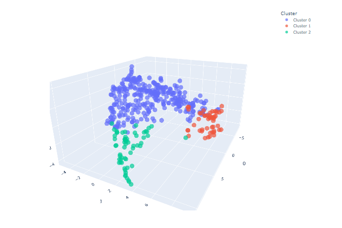
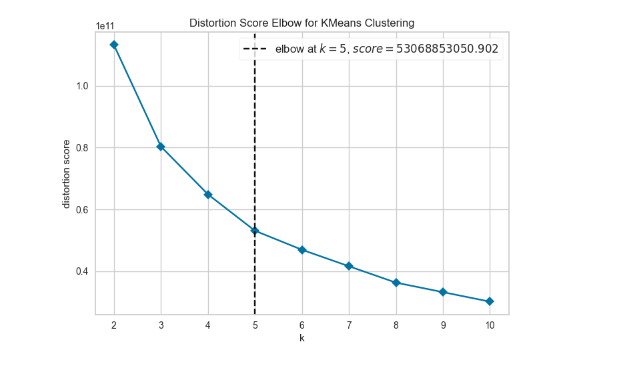
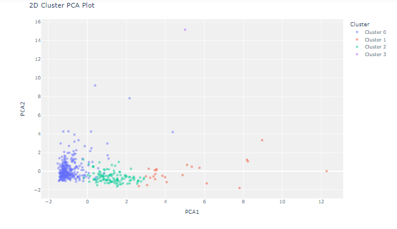
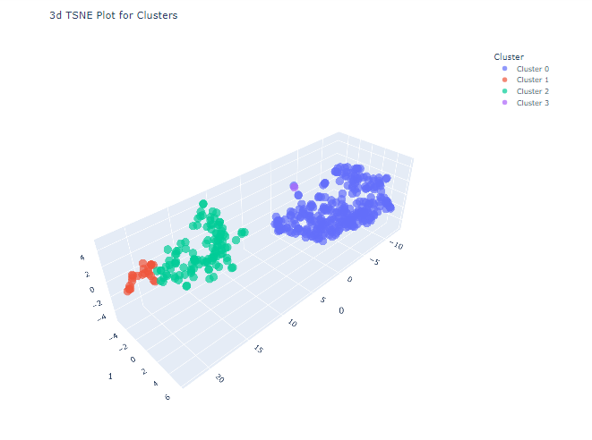
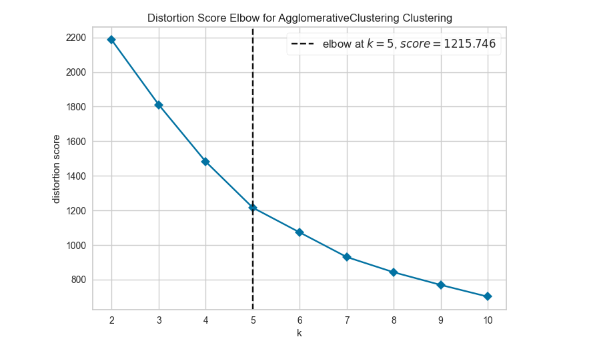
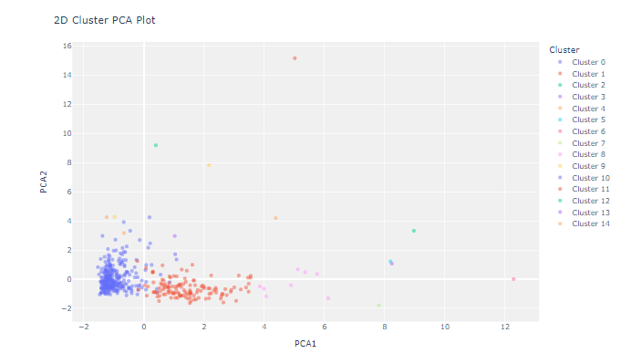
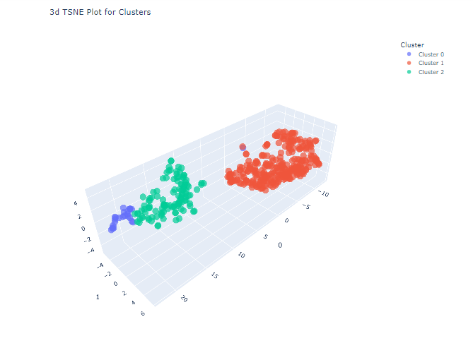

# Clustering Analysis using Pycaret

The following notebook utilizes Pycaret python package to accomplish a comparitive performance study of different clustering algorithms using a combination of pre-processing techniques and varying number of clusters on different evaluation parameters.

## Dataset description-

### Following Clustering models have been used-

1. K-means Clustering
2. Heirarchial Clustering
3. K-means Shift Clustering

### Following preprocessing techniques have been used in a variety of combinations-

1. Normalization
2. Transformation
3. Principle Component Analysis

### Following evaluation parameters have been considered-

1. Silhouette Score
2. Callinski-Harabasz
3. Davies-Bouldin

## Results-

## 1. For K-means Clustering, best performance was achieved without any preprocessing-

#### Cluster plot-

#### 3D plot-

#### Elbow plot-

## 2. For Heirarchial Clustering, best performance was achieved with Normalization-

#### Cluster plot-

#### 3D plot-

#### Elbow plot-

## 3. For K-means Shift Clustering, best performance was achieved with Normalization-

#### Cluster plot-

#### 3D plot-

